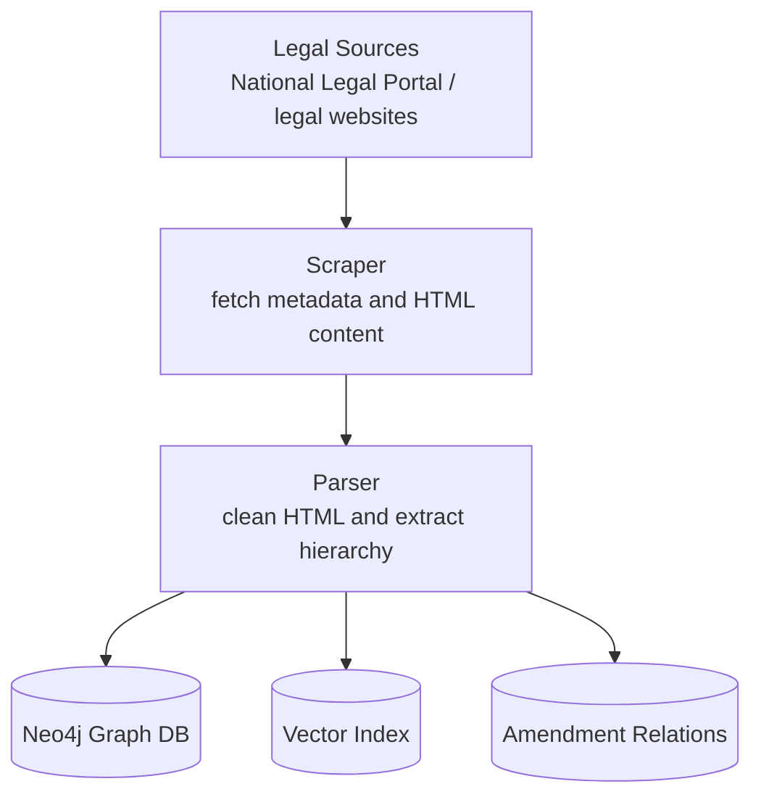
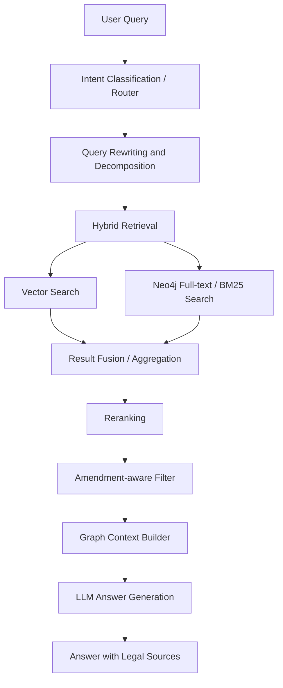
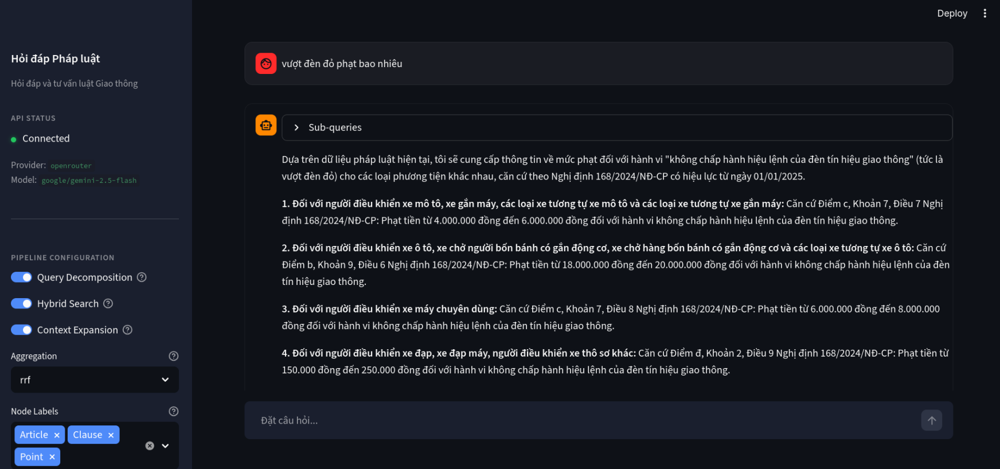

# NLP-LegalQA: Vietnamese Legal Graph RAG & QA Chatbot

[](https://github.com/thaiphucc/NLP_LegalQA_public/actions/workflows/ci.yml)

## Architecture Overview

Vietnamese legal document retrieval and QA chatbot built for an Intro to Statistical Linguistics coursework team project. The system parses legal documents into a Neo4j graph, retrieves relevant legal provisions with hybrid search, reranks candidates, constructs amendment-aware context, and serves answers through FastAPI and a Streamlit prototype.


### Data Pipeline



### QA Pipeline



## Project Note

This repository is a sanitized public version of a coursework team project. The original development repository is kept private because it contained credentials, local configuration files, and internal development artifacts.

This public repository is intended for academic portfolio and CV review. It does not include the original coursework database, private credentials, large generated datasets, model checkpoints, raw row-level experiment outputs, or internal development artifacts.

This was developed collaboratively as a team project. This public version does not claim the full project as solo work.

My main contributions:

- Query routing and query rewriting/decomposition
- Hybrid retrieval integration combining dense retrieval and sparse BM25/Neo4j full-text search
- Reranking and evaluation pipeline integration
- Legal answer generation prompts and context construction
- FastAPI and Streamlit prototype wiring

Other components, including parts of the data collection, parsing, annotation, evaluation dataset, and broader project reporting, were developed collaboratively by the team.

## Architecture

The production pipeline is organized as:

1. Query understanding: classify intent, rewrite multi-turn questions, and decompose complex legal questions.
2. Hybrid retrieval: combine dense vector search with Neo4j full-text BM25 search.
3. Aggregation: fuse multi-query results with RRF, Borda, or max-score aggregation.
4. Reranking: apply a Vietnamese cross-encoder reranker to improve post-retrieval precision.
5. Context construction: fetch graph hierarchy, sibling provisions, child provisions, and amendment metadata.
6. Answer generation: produce grounded legal answers from retrieved context with anti-hallucination prompting.
7. API/UI: expose the pipeline through FastAPI and a Streamlit chat prototype.

## Amendment-aware Legal Reasoning

The RAG pipeline is specifically designed to handle the complexity of Vietnamese legal documents, where provisions are frequently amended, supplemented, or replaced by subsequent laws. 

- **Graph-based Dependency Tracking**: Amendment relationships (e.g., `THAY_THE`, `BO_SUNG`, `BAI_BO`) are stored natively in Neo4j.
- **Context Expansion**: When a specific Article or Clause is retrieved, the pipeline queries Neo4j for any related amendments. 
- **Stale Context Penalization**: Outdated or replaced legal documents are penalized during the retrieval phase to prevent the LLM from generating answers based on expired laws.
- **Hierarchical Construction**: The context injected into the prompt contains both the original provision and its explicit amendments, ensuring the LLM reasons over the most current legal state.

## Repository Structure

```text
README.md
LICENSE
.env.example
.gitignore
docker-compose.yml
pyproject.toml
uv.lock
src/legal_scraper/       Core scraper, parser, Neo4j import, retrieval, reranking, API
streamlit_ui/            Streamlit chat prototype
scripts/                 Evaluation and local Neo4j demo setup scripts
data_sample/             Small non-sensitive sample parsed document
docs/evaluation.md       Sanitized evaluation summary for portfolio review
tests/unit/              Offline tests run by default
tests/integration/       Optional tests requiring Neo4j or external services
```

## Setup

```bash
uv sync
```

Copy the environment template and fill in local values as needed:

```bash
cp .env.example .env
```

On PowerShell:

```powershell
Copy-Item .env.example .env
```

## Demo



The RAG pipeline requires Neo4j, embeddings, a reranker model, and an LLM endpoint. For public review, this repository includes an offline demo mode that returns deterministic sample responses with mock source cards and timing data.

Terminal 1:

```powershell
$env:LEGALQA_DEMO="1"
uv run legal-api
```

Terminal 2:

```powershell
uv run --extra ui streamlit run streamlit_ui/app.py
```

Then ask:

```text
không đội mũ bảo hiểm phạt bao nhiêu
```

Demo mode is only for showing the API/UI flow. It is not legal advice and does not exercise the full graph RAG stack.

## Testing

Run the default public test suite:

```bash
uv run --extra dev pytest
```

Default tests are offline unit tests. They do not require Neo4j credentials, a running database, downloaded embedding models, local LLMs, or API keys.

Run optional integration tests only after configuring Neo4j:

```bash
uv run --extra dev pytest -m integration
```

Integration tests skip gracefully when required environment variables are missing.

## Neo4j Sample Pipeline

1. Start Neo4j:

```bash
docker compose up -d
```

2. Initialize constraints and full-text indexes:

```bash
uv run python scripts/init_neo4j.py
```

3. Import sample data:

```bash
uv run python scripts/import_sample_data.py
```

4. Run integration checks:

```bash
uv run --extra dev pytest -m integration
```


## Evaluation Summary

The original coursework repository contains larger QA datasets, model outputs, row-level evaluation CSVs, and experiment artifacts. This public version keeps those private or omitted, but includes a sanitized high-level summary in [`docs/evaluation.md`](docs/evaluation.md).

Highlights from the internal evaluation snapshot:

- Hybrid graph/vector retrieval improves over the basic RAG baseline.
- Reranking and multi-query aggregation improve retrieval quality in most ablation settings.
- Hosted zero-shot/few-shot LLMs outperformed the small fine-tuned model in judged legal answer quality, while the fine-tuned model remains useful as a reproducible local experiment.


## Core Commands

Search for legal documents from the public source API:

```bash
uv run legal-scraper search "Luật" -n 10
```

Parse downloaded documents:

```bash
uv run legal-scraper parse -i data/ -o data/parsed/
```

Import parsed documents into Neo4j:

```bash
uv run legal-scraper import-neo4j \
  -i data/parsed \
  -a data/amends \
  --uri "$NEO4J_URI" \
  --user "$NEO4J_USER" \
  --password "$NEO4J_PASSWORD" \
  --database "$NEO4J_DATABASE"
```

Run the full retrieval pipeline when Neo4j and models are configured:

```bash
uv run legal-scraper query \
  -q "không đội mũ bảo hiểm phạt bao nhiêu" \
  --uri "$NEO4J_URI" \
  --user "$NEO4J_USER" \
  --password "$NEO4J_PASSWORD" \
  --database "$NEO4J_DATABASE"
```

## Notes

- This repository does not include the original private Neo4j database.
- Demo mode uses mock responses and does not perform real retrieval.
- Full retrieval requires indexed Neo4j data, embedding models, a reranker model, and an LLM endpoint.
- Legal answers generated by this project are experimental and should not be treated as legal advice.
- Some historical experiment scripts are retained for context but require user-provided data and credentials.

## License and Attribution

This code is released under the MIT License. The original project was developed collaboratively for coursework; attribution and copyright details are preserved in [`LICENSE`](LICENSE).

